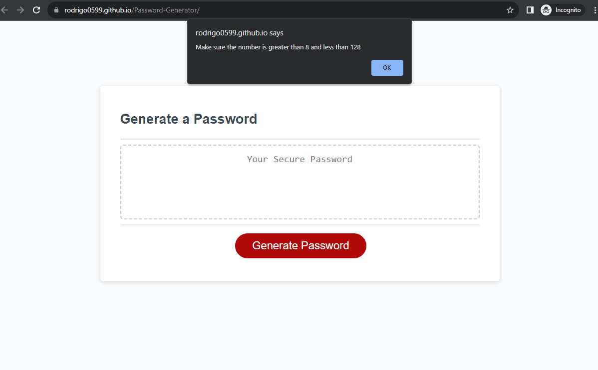

  # Password Generator
  ## Description
  This project aims to provide a user-friendly password generator to help individuals secure their online accounts. It utilizes JavaScript to generate random passwords based on user-defined criteria.
  
  ## Table of Contents
  - [Installation](#installation)
  - [Usage](#usage)
  - [License](#license)
  - [Credits](#Credits)
  - [License](#License)
  - [Features](#Features)
  
  ## Installation
  You can access the Password Generator online without any installation.
  
  ## Usage

  You can access the website here: https://rodrigo0599.github.io/Password-Generator/

1.Click the "Generate Password" button on the screen.

2.A prompt box will appear, asking you to select a password length.

3.If you fail to set a password length within the specified criteria, error messages will guide you.

4.After correctly setting the password length, confirm which character sets to include by clicking "OK" or "Cancel."

5.Once you've set a correct password length and confirmed at least one character set, the website will generate a password in the text box.

6.You can refresh the page and repeat the process as needed.

  ## Credits
  Rutgers Full Stack Coding Bootcamp for starter code.
  ## License
  MIT License.
## Features 
Javacript Prompts, confirms.